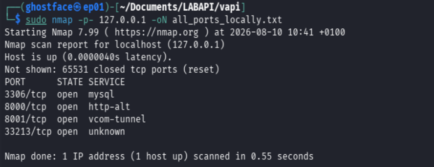

# VAPI LAB

Owner: Edwar Puentes

Start with nmap to find some open ports and we see the next.



we go with explore more this ports trouhg to the browser.


When you download the swagger file you need to import to postman, and start with the first exercises,

## **API V1 Broken object-level authorization**

#### **Create USER**

you need to create a user, thsi POST Re


so we need to check if the user is create, here some tips, once upon you create the user, in the reuqest to get or consult user you need to be authenticated, but you don´t need put the password, you need put the combination between user and password codified on Base64 like this

user:passsword

for this example you can create this combination on linux with the next command.

```bash
echo -n ‘testing:TESTING.123’ | base64
```


the result, is the authorization  token for this exercise.

#### **Get USER**


1. ID : if you remember when created the user, the response has id, in this case is the number 9 please go above and check the ID,
2. api1_auth : Here space is the base64 codification between user and password, please see the image above on linux creation. 

#### **Modify the user**


here we are, we changed the course from API PENTESTING to WEB PENTESTING, just a simple modification, however.

1. api1_id, is must be equal 9 becasue this is the ID for this user,
2. Authorization, here we find the authorization token, is the combination between user and pass codified in Base64,
3. the responde.

So here is the functionally to the first section of this LAB, so we can start to verify is one user can see different info for others user, 

#### **Burp Suite.**

We can start with the first vulnerability and is, can I see the info for other users?

so use burp suite to intercept the traffic and send one valide request.   


1. URL to send the request
2. Number of ID, for this LAB 9
3. The authorization token.
4. the responder

We put this request on repeter and change the number of ID, so if work that means, with our authorization token we can see another info.


this confirm we can see more info, if you see the imagen above we consult the ID number 2, but we put our AUTH.TOKENS and the responded is the info for meredithp.

to capture our flag you must send the ID = 1


## **API V2 Broken  authorization**

For this laboratory we must to read the clue and say the next:

API2

Broken Authentication

***We don't seem to have credentials for this , How do we login? (There's something in the Resources Folder given to you )***

this is very important, we can check this info go to the repository, the most important Word, ***Resources.***


So, we find a csv file so we need to chek this info.


Good, we find some user and password, so we can try to one of them, go to Postman and try to made a request.


Defintly we have the discover how can I login in this section.

1. We have a user passwd list.
2. we have burp suite ( we need to create a brute force attack )


we can intercept the traffic, and send the request to intruder, we must need be cautelousm becuase we need to send info with special characters so we need to make some configurations into burpsuite.

start.


In intruder we need to put the info in the correct section so.

1. we need to choice the Pitchfork attack
    1. A **pitchfork attack** most commonly refers to **a specific type of multi-parameter payload injection used in web security testing**
2. Choice the correct spaces, for this case, the email and the password.
3. Load a list where  you found, exploring the folders in order to check the “Resources Folder”

The next image is very important, because in this section wee need to configure how this payload is will work in each request, we are use spcecial characters, we need send the request without anything about encode so.


choice the Math Rule. and put on Match regex: .*,  Replace with : NULL


Another important tips, in the down site exist the Payload encoding section and we need to unselect the option.


General Image


we to do the same but in the password section, please see the above image and do it.


after make the configurations start the attack and waiting for the results.


the attack is finish so we need to check the results.


as you see, we orgnized ever results for the filed status code = 200 so in this part we have 3 results, go to postman and lets see what happen whit this results.


As you see we ha 3 access sucessfull;  but please focus in the password from those of 3 user, we have 2 user with the same password.  harber.leif@beatty.info and hauck.aletha@yahoo.com has the word kU-wDE7r like password.

so we go to the next method on VAPI, in this exercises call get details.


 the image above, you can see the fields, we are on API2, more down you see the folder details, and inside this folder with have the Get details request.

1. api_auth = the authorization, is the respond call token, please check the prevoius image where we confirm the access.
2. the respond with the request, as you see we have the information for these 3 accounts.

**VULNERABILITY**: here is the things.

1. the applications is don’t has control over the request, if you remember we made a brute force attack.
2. we found the csv file with many users and password, so this count like information disclosure.

## **API V3 Excessive Data Exposure**

This exercise need a little of Pentesting mobile, so you must be install and configure Android Studio and burp suite, is the best to introduce to hackingMobile, so let´s start.

Android Studio you can download for the official site.

https://developer.android.com/studio

And burp suite, for this chapter I would like to start made the correct configuration for burp suite and the Android device emulated.

#### Burp Suite.

Start with a need listener to intercept de traffic.


so the first step is create the listener with the ip address asigned by the network, here we don´t work with a loopback ip ( 127.0.0.1) because the android need some ip address inside the same network.

### Export the certificate Burp Suite.

you must export the certificate in der extension, when you have the file change by .crt


#### Android Emulator

After has the certificate, we need to move to android studio and create a new virtual device, my advisor for this is use old version of android to avoid some behavoiru slow over the device. let´s start.


I use the next for the size of screen, for the simplicity of use, 


1. Name of your device, optional.
2. Api: the version of android we use, for this example I choice Android 10.
3. Services: I choice Google Apis, because in this options you don´t need a google account, the other options is Google Play Store, but you should configure this virtual device like a real device, I mean the google account, the updates for the OS, download the applications, this is more realistic, but for this exercise is enough google apis options.
4. the image for the OS Android.
    
    for the Addtional settings you have more options, in this lab we don´t need check, we nee leave by default. 
    
    
    
    when you select the image, the Finish buttom appear and after that android studio need confirm to download the image.
    
    
    
    
    
    
    
    Here is our Emulated Android, so press Start buttom please.
    
    
    
    and voilá here is our cellphone.
    
    
    

#### Deploy certificate and configure Proxy on Android

if you remember we had made a configuration for a new listener in bupr to intercept the traffic, if you forgot, please go the burp suite section.

#### **Deploy Certificate**

in the android device go to files, documents and take the certificate from bupr suite and transfer, you can drag and drop between screen.


in a short time you must be the file on the device.


#### **Install certificate on Android**.

Disclaimer: this certificate usually is for intercept the cipher traffic like HTTPS, for this lab is not necessary, however we must to know how can we do it.

In the android device go to Settings >  Security > Encryption & Credentials. > Install from SDCard ( Install certificates from SD Card)

Find the certificate file.


Double click on the file, in this case put the name, and you need to choice credential user leave vpn and apps if you see the red letter´s it say, The issuer of this certificate may inspect all traffic to and from the device and press ok.


you can see the certificate in 

 Settings >  Security > Encryption & Credentials. >User credentials.


#### Proxy Configure in Android Device.

if you see the android has a little menu on the left side, you need to go and press the 3 points on there.


in this section you have more options to configure the device, however we focus on the proxy.

go to settings > in the left side you must see the proxy options, please click.


Put the information from a new listener configured in the step before, for this lab I have 

- Ip address, 192.168.165.235
- Port 8081

Close the advanced settings.

Go to android again, but you need to go to settings > Network & Internet > yous must choice the androidWifi connected but in the settings inside this network  > Edit > and you see andvanced options.


And there is all for configure the android device with a Burp Suite we need to see if working.

#### **Test: Capture the traffic with burp suite.**

you must open burp suite, and have 

- Newer configurated listener
- The Android proxy is configured

In burp suite go to intercept and confirm you intercept is ON.


Form the testing go a chorme inside the android device a search something, you must see the request intercept on burp suite.


this is like you has the burp suite and the android studio working

#### **Continue with the exercise,**

After has the traffic intercept with burpsuite with our android device,  in the vAPI folder you need to go to Resources and you have the next folder.


open the folder API3_APK and you have 


from the same way you transfer the certificate, you need to transfer this apk file into the android device.


we can check the APIV3 from the VAPI app, 

1. It´s say something about the resorces folder, and the Exercise talk about Expose data. se i you have the swagger file into postma you can create the user, but you don´t see anything about expose data, that is why we need to deploy all about the android device emulate.


Return to the app. you can open and configure the url for the exercise and save.


once upon you saved the info you have the next image, 


as you see we can create account in the down side


we need to complete the info, you need  ( for my lab I sent this info ) and register

- ID:   2
- PASSWORD: 123.123
- Display Name: Test


After that we need to open burp suite and check what happened, and we see the request of course my focused traffic capture is the request to the application and if you see we have the request to create the user.


and we going to check the behaviour when you made the authentication.


in the above image you can see the request we have 2 request, 1 POST and 1 GET, so let´s investigate.

1. User validate, POST, we sent the authenticacion with ID and Password and the responde is a user validate, the body of the request say success = true.


1. Post, we have our Flag, the Get request is something is come to from the application and expose information as we don´t need, that´s our Lab resolved.

Expose information

```json
[
 {
	"id":1,
	"postid":"1",
	"deviceid":"flag{api3_0bad677bfc504c75ff72}",
	"latitude":"45.5426274",
	"longitude":"-122.7944111",
	"commenttext":"THIS POST IS SH***Y",
	"username":"baduser007"
	}
]
```


**Vulnerability** : The API is returning excessive information in response to the login request, however not reflecting everything on the interface but use a proxy tool such as Burpsuite can help in finding unnecessarily exposed data.

## **API V4 Lack of resources and rate-limiting**

Basically we have 3 methos in this ocassion, according to the postman in the apiV4.


1. insert and send a number of phone,
2. when you send the first request you muts send a token to see the details on the request 3.
3. you can see the details of the user, with a token received between the 1 and 2 request


Say that, we need to use the burp suite, and discover what is the otp correct. the flow is, you sent your phone number, the app send to you the otp, and for check the user you need the “token” to see that information, some important to check the OTP SAY 9999 like exmaple we can asume the otp is a maximum with 4 numbers.

Burp Suite


for this lab we need to use the second request in order to discover the OTP code, start with send the number phone, wait for the responde 

intercept the request OTP


we send this request to intrude, prepare the payload with number and one range betweeen 1001 and 9999, of course this take a time and start the attack.


after has the responses for each request, we see the OTP valid code, for this exercise the OTP code is 1872.


we go to burp suite, change the original request and use this token in order to capture the info.


take the token and go to postman.


The response show us the flag 


> **flag{api4_ce696239323ea5b2d015}**
> 

**Vulnerability**: we see in this occasion several problem, but the most relevant is the opportunity to send a several request without block, and discover the token for this user.

in a short answer we got around rate-limiting on the second-factor authentication mechanism (OTP) by performing a brute-force attack on the OTP value and obtaining the correct OTP and so user data.

## API V5 Broken Function Level Authorization

The goal here is try to search some information about one user and with this infor try to see information about others user or admins

so let´s start.

For the next imagen we have the api5 testing in vAPI platform, as you see we have:

1. request to see details about user
2. request to create a user - in this case the example we are use. 
3. the info sent to vAPI ( name, user, passsword, address, mobile )
4. the responses from the create user request; with a single diffence if you see we have the field ID=10


go to the Get user request and do a simple request without info.


so in this case, for a successful request we need 2 details.

- api5_id
- api5_auht

whe you create one user you have the api5_id in the above image “when we create the user” obtained the id equeal 10

so where is the token, usually in this case the token is the combination from user::password in base4 encode. 

user: testuser45

password: admin.123

```bash
echo -n  'testuser45:admin.123' | base64 
```

you can run this command in your terminal and obtained the base64 encode token. 


other simple way is use burpsuite, previously we captured this request, to show you how can do it in the burpsuite.


You need to send to repeter of intercept and modify it.

Put the combination in clear text, pointed, left click and find base64 encode and send it.


as you can see, we have the correct answer and received the information about the user with id 10. but what happen if I try to discover the vulnerability.


Lets see we can see the user details, in the path /user/*(id) and the correct token, maybe we can start to play with the path. 

so if we need to see the users in “plural” maybe add the ‘s’ at the end of the user.


as you can se we have the flag for this activity.

**VULNERABILITY:** We retrieved information about other users by making an educated guess about a page that was not directly accessible to normal users but didn’t have any authorization checks in place to validate the user’s privileges.

## API V6 Broken Function Level Authorization

## Mass Assignment

sometimes APIs accept user input from the client and save it in the database without filtering it. To get unauthorized access to restricted features, an attacker can identify extra objects via API documentation, educated guesses, or HTTP replies and include them in the request. For example, an attacker may attach the &admin=true argument to a user’s registration and acquire admin capabilities.

here is the LAB we have the clue

**Welcome to our store , We will give you credits if you behave nicely. Our credit management is super secure**

start with the postman and Create user request


and see the response and if you check the response has a id varaible in this case 6


and we have a second request, Method GET to have information about the user as you can see one field need the rigth token so if you remember the last exercise the token is the user + password encode in base  64. for this case user michael01 y password admin.123


token.


response for the get user request.


ok so here we have one request to create and one requtes to check details, but as the clue say, **Welcome to our store , We will give you credits if you behave nicely. Our credit management is super secure**

I think the magic word is “Credits,” and the LAB mentions mass assignment, so if you look at the vulnerability, it basically says that API services can’t trust everything the user sends.

what happen is in the processs to create the user we put the field credits and send this request? maybe when we try to chek the details we can see the credits put in the first request,  let’s do it.

as you can see in the below image we will send the information plus the credits.


firstable we can see is 200 OK and we have a new ID,  we can write the information.


let’s go to check the details, weneed to send the second requesto to check the info but we need to confirm this new user has 10 credits.

Token = user:password


and ok this user has 10 credits, but we can´t capture the flag.


We have 2 options, create one by one until see the flag, or use burp suite to create a automatize this procedure.

1. Create user, for this case we would like 100 user, so I use one list, JOHN unitl JOHN100 and the same password for all.


for the password I  create the C column like user:password. and copy this info to a text file. 


and create this routine in bash to export a list for tokens.

```bash
while IFS=: read -r user pass; do
token=$(printf '%s:%s' "$user" "$pass" | base64 -w 0)
echo "$token"
done < user.txt > tokens.txt
```


I don’t know it works but we can try to one of them, we takem the first line to create and after cechk the details.


OK for the creation it’s good.


here is our challenge,


I think is look nice we need to automatize this procedure, in order to check the best exercise, we need to create the user first. so we need name, username and password and the user is one incremental for the name JOHN from alone until 100

field need 

- NAME: JOHN(X)
- USERNAME: JHON(X)
- PASSWORD: Admin123 — the same for everyone.
- CREDIT = Increase number from 0 to 100

we have our payload ready, remember we need to capture the flag so we need to see have number of credits show us the flag.


Type of intruder, Pichfork attack. 

1. Name incremental JHON like first word and number of incremental 0 - 100
2. Username> the same technique for name
3. credit : incremental 0 - 100
4. Payload position,
5. Payload type : Numbers
6. Number incremental from 0 - 100

Start. and the end of this exercise we created 100 user in the app.

As you see in the below image we can 100 200 OK Responses everyone with your own credits from 0 to 100


so now we need to get the details for each user, so go again to burp suite, capture the request and send to intruder, organize the payload position, load the file, unselect paload encode characters, with all tokens and go it.


well we have 100 request with 200OK reponses, so just let check what is the flag, if not exist  you must be increase the number of the payload.

so if you put 100 credits when you create the user you have the flag.


## API V7 Security Misconfiguration.

“Hey , its an API right? so we ARE expecting Cross Origin Requests . We just hope it works fine.”

follow the logic in the flow we have 4 request

1. Create user
2. Login user
3. Get key from the user
4. logout user.

let´s see how is work the flow.

Create the user.


response.


go for Login user, remember the token is the combination by user:pass encode in base64


as you see the image above we can access or login to the “platform”

Get Key, as you can see the Get key does not has anything in the body and in the headers so if assume the authentication before this it was sucessfull we have the chance to see the “Key”


Headers, nothing special


and we obtained the key.


Can we capture the flag? well actually if you remember the clue  it say, “*Hey , its an API right? so we ARE expecting Cross Origin Requests . We just hope it works fine.”*

talking about the CORS so we can out like header the parameter Origin :  [www.example.com](http://www.example.com) and maybe we can capture the flag let´s do it.


**VULNERABILITY:** happens when a web server configures its Cross-Origin Resource Sharing (CORS) headers too loosely. This allows malicious external websites to read private data or perform unauthorized actions on behalf of a logged-in user through their browser.

## API V8 Injection

Clue: I think you won't get credentials for this.You can try to login though.

In this exercise we have twice request. 

1. POST: User Login 
2. GET: Get Secret

both request doesn´t has anything about body, so we need to assume, need the user and password and after that the token (user:pass // encode  base64) reveal the flag, we have two clues for this exercise, firstable the exercise call injection, and the most often way to break one autehtnciation is throug SQL injection.

 SQL injection, also known as SQLI, is a common attack vector that uses malicious SQL code for backend database manipulation to access information that was not intended to be displayed. This information may include any number of items, including sensitive company data, user lists or private customer details.  https://www.imperva.com/learn/application-security/sql-injection-sqli/


We gona to use burp suite, intercept the traffic and made a sql injectio with list

in postman go to settings > proxy > enable proxy with the right info.


open Burp Suite and check if the intercept traffic is on and listening in the right port for this case 8080


take postman and send the request in order to send user and password, send to intruder, configure the payload positions, payload options


Pitchfork attack that mean each position send the information, for this lab the user and password field send the same SQL Injection.


At the end of the attack we see the successful Injection


With the Auth token we can take access for the flag, so let´s check.


we are capture the flag !!


**VULNERABILITY** :

## API V9 V2 Improper Assets Management

Clue: Hey Good News!!!!! We just launched our v2 API :)

for this lab we need to start with the clue, and it say something about we have a new version, we go to check.

Postman, go to request and see api9 version 2, 


We have only one request and just one user and **** the pin code to use whe you use this request we have the response 200 but we don´t see anything more, so we need our burp suite tools.


Burp Suite.

Start to capture the traffic


analysis from the capture request, we have

- The path,
- The response 200 OK
- Something interisting,  X-RateLimit: 5 and X-RateLimit-Ramaining: 4


So that means this API has rate limitis control, so we don´t can create a brute-force-attack or even SQL-injectio because the API will start to block. 

but waht happens if i change the version of the API, follow the clue say. we launched a new api maybe the V1 is still working.

Humm interisting the V1 path it work, and we have some interisting headers, in order to compare with the last request, if you check in the V1 API doesn´t exist the control of Rate Limits so we can performance a brute-force-attack with numbers. 

we will send the request to intruder.


Intruder, we mark the position over the asterisk, we set the payload like numbers, and the payload configuration we put a rang from 1000 to 2000, start the attack.


after sent the attack, we have the next response.


Thats mean we found the flag.

**VULNERABILITY:**

v2 of API was launched with improved security mechanisms but v1 was still left open to invite attackers for a feast.

## API V10 Improper Assets Management

We start with the last exercise, API V10  here one shot of the browser.


Analysis: this is the clue<< **Nothing has been logged or monitored , You caught us :( ! >>**

In this latest exercise, it has been observed that many API services are not subject to adequate monitoring and supervision; as a result, attackers who discover such vulnerabilities can sometimes establish persistence and remain within the system for a long time. This is precisely when a procedure is required that fulfils all the above criteria, whilst also monitoring and understanding the normal behaviour of the services.

in this case with a simple request, with GET like a method we can obtained the flag.


